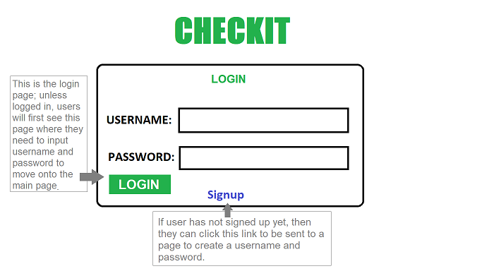
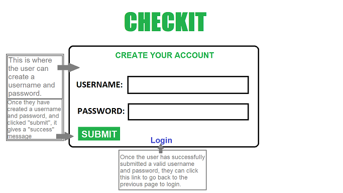
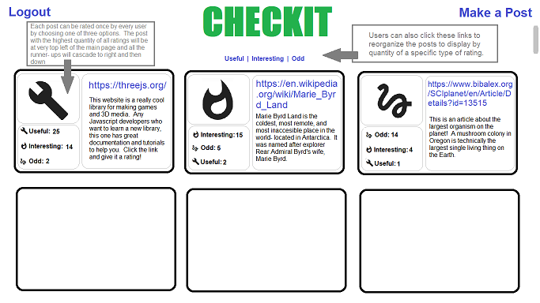
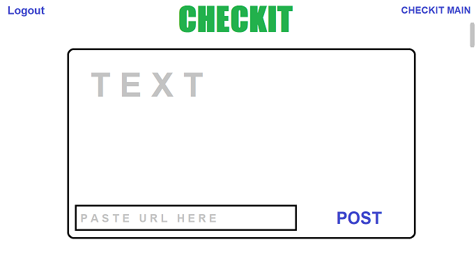

# CheckIt

### Table of Contents:

* [Summary](#What-is-Checkit?)
* [Development](#How-is-Checkit-being-developed?)
* [UI/UX](#Checkit's-User-Interface: )
* [Application Link](#Deployed-Application)
* [Contributors](#Contributors)
* [Web Authentication](#Authentication: )

### What is CheckIt?
#### CheckIt is an online bulletin board application where users can post noteworthy websites that they have found, and other users can rate the post with different metrics.  

### How is CheckIt being developed?
#### CheckIt is a full-stack MERN application (Mongo, Express, React, Node) which also uses JWT authentication via auth0.com.  CheckIt is currently under development.

### CheckIt's User Interface:
#### -Once the user goes to CheckIt, they will be sent to a "login" page to login with their account.  If the user doesn't have an account, they will have to navigate to the "signup" page.

#### -When user is on the "signup" page, they will create a username and password to login with.  Once created, the user can go back to the "login" page and login with their new credentials.

#### -If the user is logged in, they will be taken to the main page of the site. The main page will display all of the posts as cards, which contain the URL of the posted site, a description of said side written by the user, as well as displaying the three metrics users can vote on.  The post with the highest amount of ratings will be displayed on the top-left of the list and the rest will descend to the right and bottom depending on quantity of ratings.  Users can also sort the list by specific ratings, where the the post with the highest specific rating will be listed first.

#### -For a user to make their own post, they can click the link to the "make a post" page.  In order to make a post the user needs to add the URL of the site they are trying to share as well as a text description.

### Deployed Application:
#### Heroku Link: https://secret-cliffs-11777.herokuapp.com/
### Contributors:
#### Jim Greasley: https://github.com/JimGreasley
#### Michael Plichta: https://github.com/mekaleka
#### Trevor Dorn: https://github.com/dorntrevor7
#### Sean Rooney: https://github.com/Sean-93
### Authentication:
#### CheckIt requires users to be logged in to use the application; here is a link to the website for Auth0, which is the user authentication software used by CheckIt: https://auth0.com/